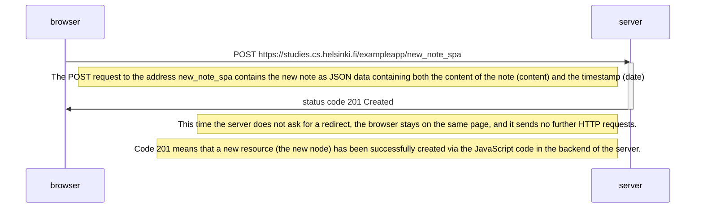

```mermaid
sequenceDiagram
    participant browser
    participant server

    browser->>server: POST https://studies.cs.helsinki.fi/exampleapp/new_note_spa
    activate server

    Note right of browser: The POST request to the address new_note_spa contains the new note as JSON data containing both the content of the note (content) and the timestamp (date)

    server->>browser: status code 201 Created
    deactivate server
    Note left of server: This time the server does not ask for a redirect, the browser stays on the same page, and it sends no further HTTP requests.
    Note left of server: Code 201 means that a new resource (the new node) has been successfully created via the JavaScript code in the backend of the server.
```